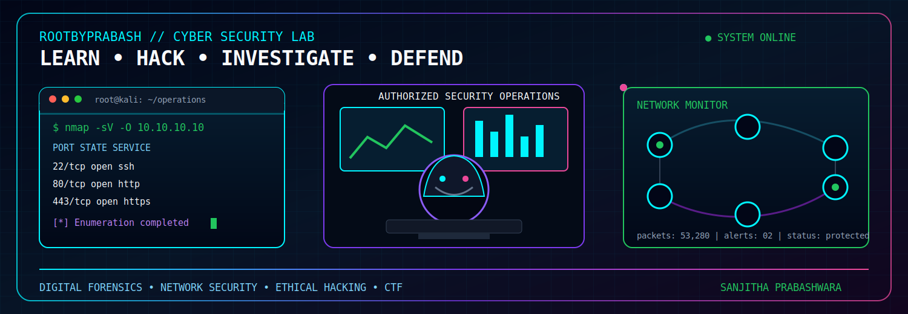



# Hi, I'm Sanjitha Prabashwara

### Cyber Security Undergraduate from Sri Lanka

## About Me

I am a Cyber Security Undergraduate focused on understanding how systems are attacked, investigated, and defended. I build my skills through hands-on labs, security research, CTF challenges, and practical projects across offensive and defensive security.

- Based in Sri Lanka
- Building practical experience in penetration testing and digital forensics
- Exploring threat detection, incident response, and secure infrastructure
- Working toward becoming a professional **Cyber Security Engineer**

## Focus Areas

| Offensive Security | Defensive Security | Investigation |
|:---|:---|:---|
| Ethical Hacking | Network Security | Digital Forensics |
| Penetration Testing | Threat Hunting | Memory Forensics |
| Web Application Security | Incident Response | Malware Analysis |
| Active Directory Security | Security Monitoring | Evidence Analysis |
| Capture the Flag Challenges | Hardening and Defense | Forensic Reporting |

## Security Tools

## Programming and Platforms

  

## Currently Learning

- Advanced web application testing and exploitation methodology
- Memory analysis and artifact recovery with Volatility and Autopsy
- Network traffic analysis, threat hunting, and incident response workflows
- Active Directory enumeration, attack paths, and defensive hardening
- Malware behavior analysis in isolated lab environments
- Python and Bash automation for repeatable security tasks

## TryHackMe

  

I practise ethical hacking, networking, digital forensics, and web security through hands-on TryHackMe labs in legal, controlled environments.

## CTF and Learning Platforms

  
  

I use guided labs and CTF challenges to practise enumeration, exploitation, forensic analysis, and clear technical reporting.

## Featured Project

  

## GitHub Analytics

  
  

  

  

## Connect With Me

  

I am interested in learning with the security community and collaborating on ethical, educational, and defensive cybersecurity projects.

## Security Mindset

> "Curiosity finds the weakness; discipline turns the lesson into stronger systems."

  

